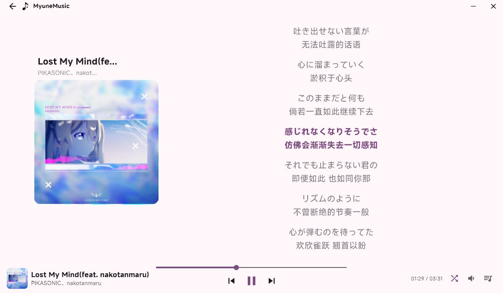
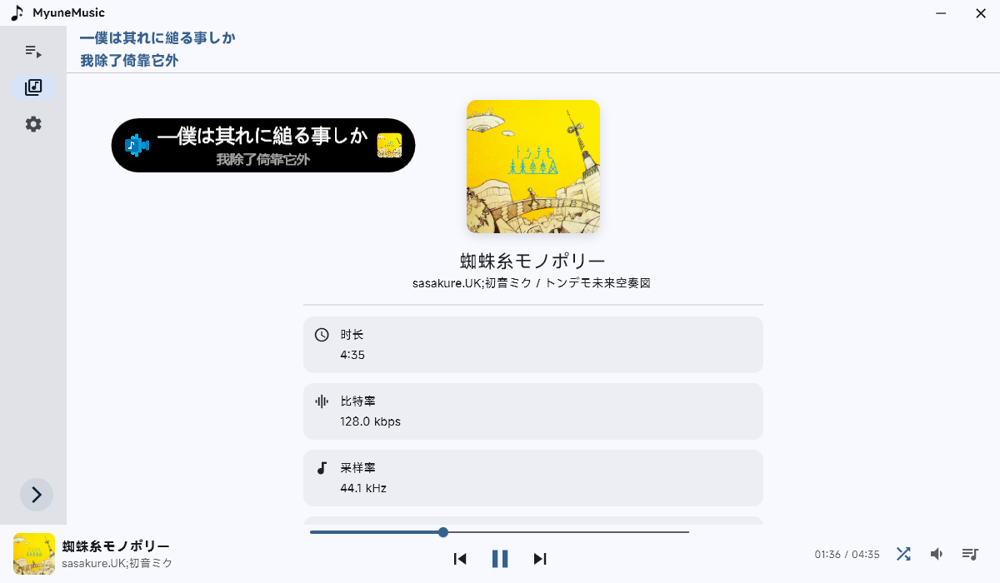
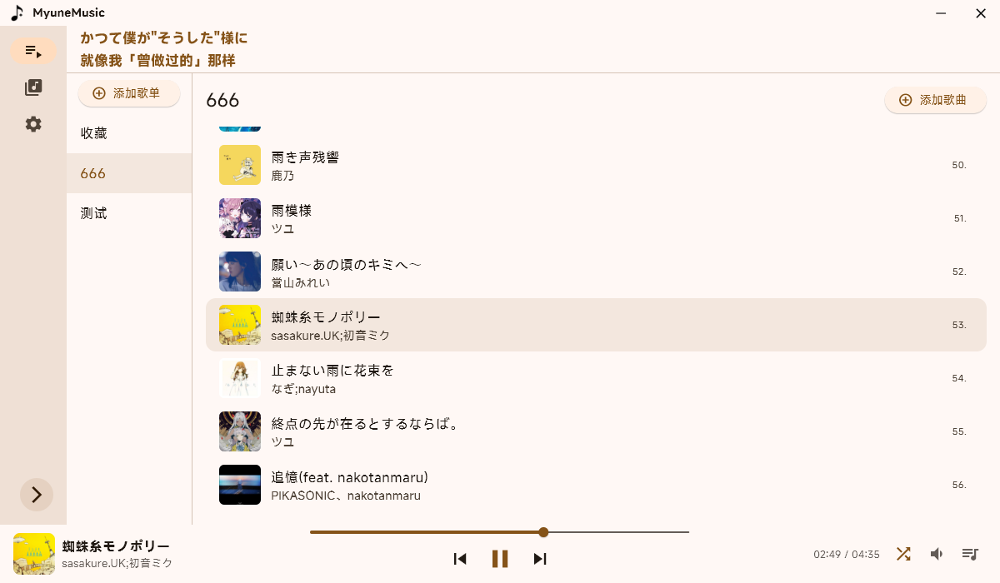

# myune_music

一个使用 Flutter(Dart) 的简单音乐播放器实现

## 特性
 - 使用 **[Material 3](https://m3.material.io/)** 配色
 - 支持多种本地音频格式导入，自动读取音频元数据
 - 基础播放控制：播放 / 暂停、上一首 / 下一首、进度调节
 - 歌单功能完善：可创建、重命名、删除歌单并添加歌曲
 - 支持歌词显示，兼容本地 `.lrc` 文件与从音频文件中读取内联歌词
 - 简单的主题调整 (自定义主题配色)
 - 音量调节与静音功能
 - 内置播放列表与播放模式切换：顺序播放、单曲循环、随机播放
 - SMTC 支持

## 项目截图

> 图2的悬浮歌词为 [lyricify-lite](https://github.com/WXRIW/Lyricify-App#lyricify-lite)
## 快速开始

### 环境要求
- Rust 环境
- FlutterSDK >= 3.8.0

### 安装依赖
    flutter pub get

### 运行项目
    flutter run

## 使用的插件

- [audio_metadata_reader](https://pub.dev/packages/audio_metadata_reader) 读取音频元信息

- [audioplayers](https://pub.dev/packages/audioplayers) 播放音频

- 感谢 [爱情终是残念](https://aqzscn.cn/archives/flutter-smtc) 和 [Ferry-200](https://github.com/Ferry-200/coriander_player) 的 Rust + Flutter 的 SMTC 实现

- 还有更多 (详见 [pubspec.yaml](pubspec.yaml) ) ！感谢所有无私开源的开发者们！

## 许可证

本项目采用 **GNU 通用公共许可证 第3版（GPLv3）** 进行许可。
你可以自由使用、修改和分发本项目，**但任何衍生作品必须在相同许可证下开源**

详情见项目根目录下的 [LICENSE](/LICENSE) 文件。

## 字体版权说明（Font License）

本项目使用了小米公司提供的 MiSans 字体。该字体由小米公司授权，允许免费商用。

字体版权归小米公司所有，详情请见字体授权协议：
[MiSans 字体知识产权使用许可协议](https://hyperos.mi.com/font-download/MiSans%E5%AD%97%E4%BD%93%E7%9F%A5%E8%AF%86%E4%BA%A7%E6%9D%83%E8%AE%B8%E5%8F%AF%E5%8D%8F%E8%AE%AE.pdf)

MiSans 官网：[https://hyperos.mi.com/font/](https://hyperos.mi.com/font/)
