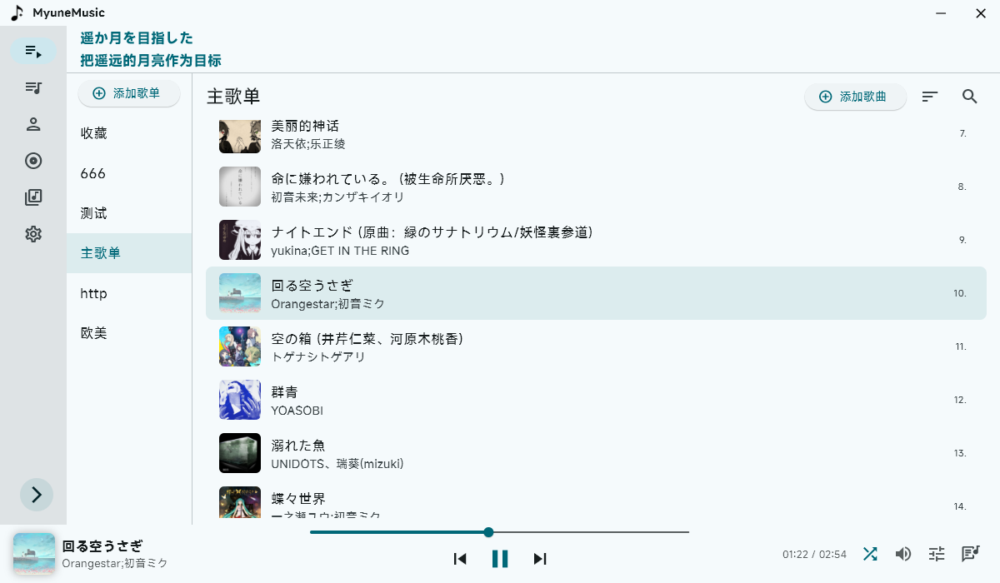
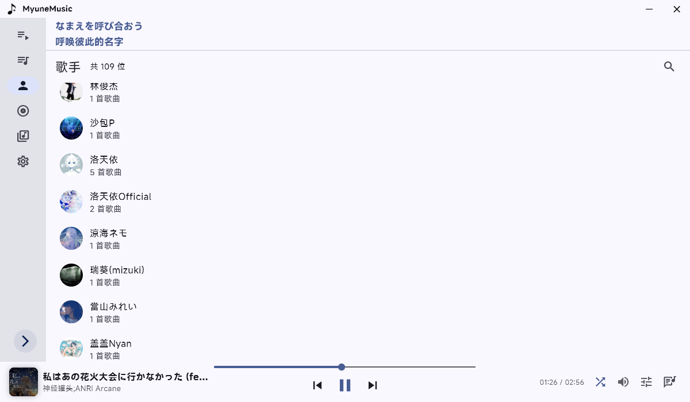
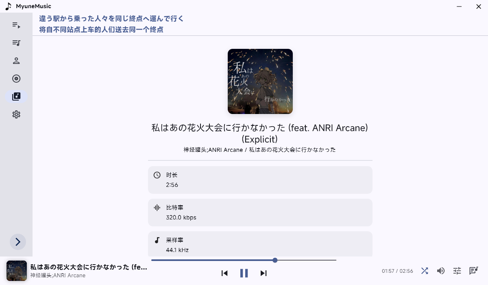

# myune\_music

一个基于 **Flutter (Dart)** 实现的简易本地音乐播放器。

## ✨ 特性
* 支持 **windows**/**linux** 双端 (linux可能会有点小问题)
* 使用歌单管理歌曲
* 支持添加文件夹管理歌曲
* 根据 **歌手** 和 **专辑** 自动分类歌曲
* 使用 [**Material 3**](https://m3.material.io/) 配色
* 支持导入多种 **本地音频格式**，自动读取 **音频元数据**
* 支持 **歌词显示**，兼容本地 `.lrc` 文件及音频文件中的 **内嵌歌词**，支持从网络获取歌词
* 提供 **音调控制** 与 **倍速播放** 功能
* 支持读取多种 **音频文件信息**
* 可自定义 **主题配色**与**字体**
* 支持 **SMTC（系统媒体传输控制）**
* 支持 Linux 下的 **MPRIS**
* 支持 **音频独占** 播放 （仅Winsows）
* 支持 **手动选择音频输出设备**

## 🎶 关于歌曲管理

软件内提供了两种管理方法 **文件夹** 和 **手动管理**
***
**手动管理** ：在添加歌单的时候选择 **手动管理歌单歌曲**，创建完歌单后手动添加歌曲

可以对歌单内的 **所有歌曲** 进行删除或添加

在添加时，可以选择**一个或多个歌曲文件**，软件会自动去除重复添加的歌曲
***
**文件夹** ：在添加歌单的时候选择 **添加文件夹**，并按照提示选择 **一个或多个文件夹**

可以随时 **右键歌单** 添加或删除文件夹

在首次添加时，软件会自动扫描文件夹(包括其子文件夹)内所有歌曲

在此之后，软件将不会静默扫描文件夹，需要手动点击 **刷新按钮** 更新

注意：使用文件夹歌单将无法 **手动删除和添加歌曲**
***

以上两种方式都可以根据 **歌手** 和 **专辑** 进行自动分类
## 📦 内嵌元数据支持

| 音频格式     | 元数据格式               | 支持 |
|-------------|-------------------------|-------|
| MP3         | `ID3v1`, `ID3v2`        | ✅   |
| MP4         | `iTunes-style ilst`     | ✅   |
| FLAC        | `Vorbis Comments`       | ✅   |
| OGG         | `Vorbis Comments`       | ✅   |
| Opus        | `Vorbis Comments`       | ✅   |
| WAV         | `RIFF`                  | ✅   |

## 🌐 关于歌词

目前仅支持UTF-8编码的 **.lrc** 文件

默认情况下，将会优先读取内嵌歌词，如果没有则读取本地 `.lrc` 文件

如果上述都无歌词的话，可以在设置中启用 **从网络获取歌词**

启用后，将在未读取到**内联歌词**和本地 `.lrc` 文件自动获取歌词

软件内默认提供了两个歌词源可供选择

实现参考 [通过歌曲名获取原文+翻译歌词](https://www.showby.top/archives/624)

### 🎵 关于歌词解析

假设有如下格式的歌词

>[02:55.031]照らされた世界 咲き誇る大切な人
>
>[02:55.031]在这阳光普照的世界 骄傲绽放的重要之人
>
>[02:55.031]te ra sa re ta se ka i sa ki ho ko ru ta i se tsu na hi to

可以看到这三句歌词对应的时间戳是相同的，那么软件内就会把它识别为同一句歌词的不同行

上述格式从上到下对应原文/翻译/罗马音

软件内提供设置`同时间戳歌词行数`，例如调整数值为2，最后一行（罗马音）就不会被显示

## 🔧关于 Linux

目前 Linux 版本仅在 **Debian 12 + Gnome(X11)** 测试过，已知问题有**无法选择字体**

目前只提供可执行文件 且图标之类的也没有，后续会考虑其他方案

### 在使用前安装依赖

需要安装 `libmpv`

例如 **Ubuntu/Debian**

``` bash
sudo apt install libmpv-dev mpv 
```

## 📸 项目截图


 



 

## 🚀 快速开始

### 环境要求

* 安装 **Rust** 环境
* 安装 **Flutter SDK**，版本需 ≥ 3.8.0

### 安装依赖

```bash
flutter pub get
```

### 启动项目

```bash
flutter run
```

## 📦 使用的插件与致谢

* [**audio\_metadata\_reader**](https://pub.dev/packages/audio_metadata_reader)：读取音频元信息
* [**media_kit**](https://pub.dev/packages/media_kit)：音频播放支持（太好用了）
* [**anni\_mpris\_service**](https://pub.dev/packages/anni_mpris_service): D-Bus MPRIS 控件
* 更多依赖请查看 [pubspec.yaml](pubspec.yaml)

感谢以下项目和开发者的无私分享：

* [**爱情终是残念**](https://aqzscn.cn/archives/flutter-smtc) 与 [**Ferry-200**](https://github.com/Ferry-200/coriander_player)：提供了 Rust + Flutter 的 **SMTC 实现参考**

🙏 再次致敬所有热爱开源、默默付出的开发者们！

## 📄 许可证

本项目使用 **Apache License 2.0** 开源许可协议。
详细内容请查看根目录下的 [LICENSE](/LICENSE) 文件。

## 🔤 字体版权说明（Font License）

本项目使用小米公司提供的 **MiSans 字体**，该字体已明确允许**免费商用**。

* 字体版权归小米公司所有
* 相关许可协议请查阅：[MiSans 字体知识产权使用许可协议](https://hyperos.mi.com/font-download/MiSans%E5%AD%97%E4%BD%93%E7%9F%A5%E8%AF%86%E4%BA%A7%E6%9D%83%E8%AE%B8%E5%8F%AF%E5%8D%8F%E8%AE%AE.pdf)
* MiSans 官网：[https://hyperos.mi.com/font/](https://hyperos.mi.com/font/)
