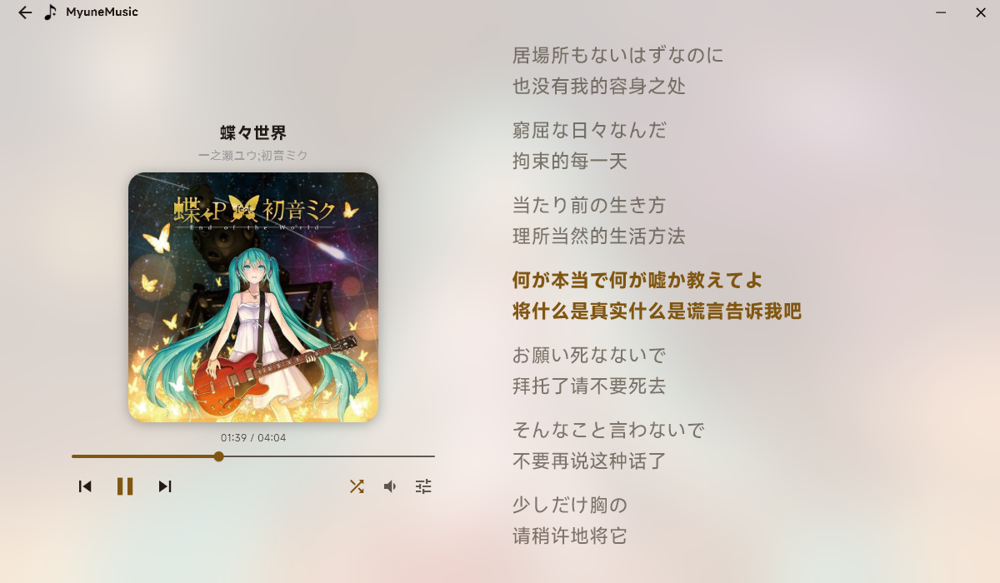
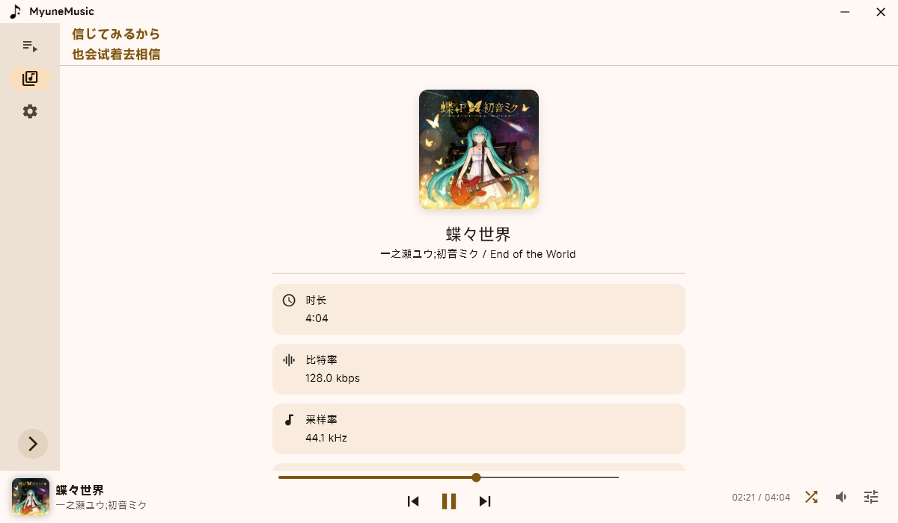
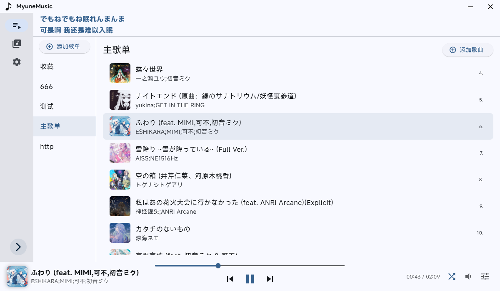
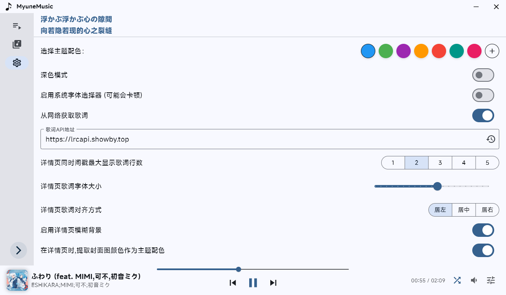

# myune_music

一个使用 Flutter(Dart) 的简单音乐播放器实现

## 特性
 - 使用歌单管理歌曲
 - 使用 **[Material 3](https://m3.material.io/)** 配色
 - 支持多种**本地音频**格式导入，自动读取**音频元数据**
 - 支持**歌词显示**，兼容**本地 `.lrc` 文件**与从**音频文件**中读取**内联歌词**
 - **左右声道平衡**和**倍速**功能
 - 支持多种**歌曲信息**读取
 - 主题调整 (自定义**主题配色**和**字体**)
 - **SMTC** 支持

## 关于从网络获取歌词
软件内默认提供了一个由我本人部署的API,但是不保证可用性

如果有条件的话，强烈建议自己部署一个API

参照 [https://docs.lrc.cx/docs/QuickStart](https://docs.lrc.cx/docs/QuickStart) 进行部署

## 项目截图

## 快速开始

### 环境要求
- **Rust** 环境
- **FlutterSDK** >= 3.8.0

### 安装依赖
    flutter pub get

### 运行项目
    flutter run

## 使用的插件

- **[audio_metadata_reader](https://pub.dev/packages/audio_metadata_reader)** 读取音频元信息

- **[audioplayers](https://pub.dev/packages/audioplayers)** 播放音频

- 感谢 **[爱情终是残念](https://aqzscn.cn/archives/flutter-smtc)** 和 **[Ferry-200](https://github.com/Ferry-200/coriander_player)** 的 Rust + Flutter 的 **SMTC** 实现

- 感谢 **[LrcApi](https://github.com/HisAtri/LrcApi)** 的**歌词API**

- 还有更多 (详见 [pubspec.yaml](pubspec.yaml) ) ！感谢所有**无私开源的开发者**们！

## 许可证
本项目采用 **Apache License 2.0** 进行许可。

详情见项目根目录下的 [LICENSE](/LICENSE) 文件。

## 字体版权说明（Font License）

本项目使用了小米公司提供的 MiSans 字体。该字体由小米公司授权，允许免费商用。

字体版权归小米公司所有，详情请见字体授权协议：
[MiSans 字体知识产权使用许可协议](https://hyperos.mi.com/font-download/MiSans%E5%AD%97%E4%BD%93%E7%9F%A5%E8%AF%86%E4%BA%A7%E6%9D%83%E8%AE%B8%E5%8F%AF%E5%8D%8F%E8%AE%AE.pdf)

MiSans 官网：[https://hyperos.mi.com/font/](https://hyperos.mi.com/font/)
