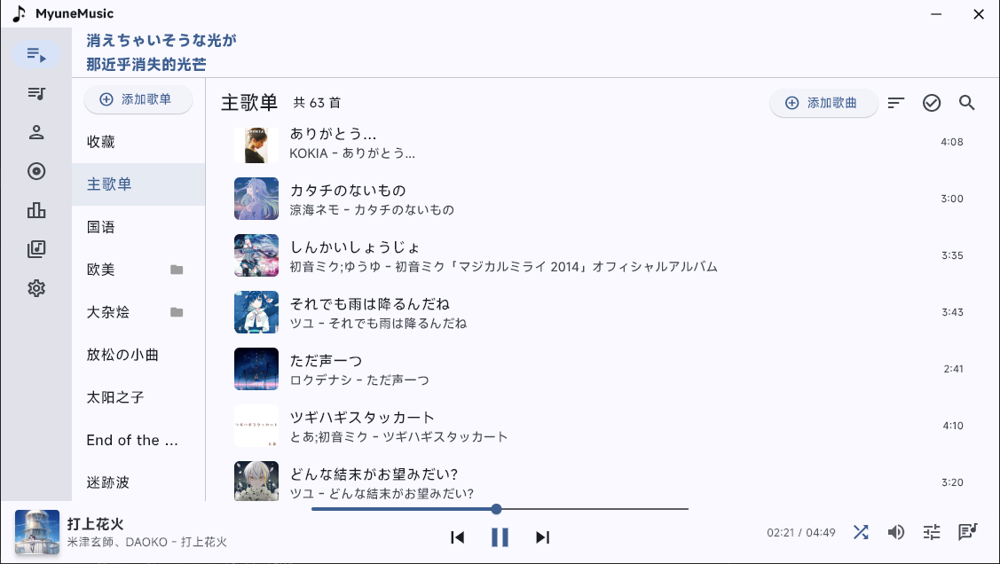
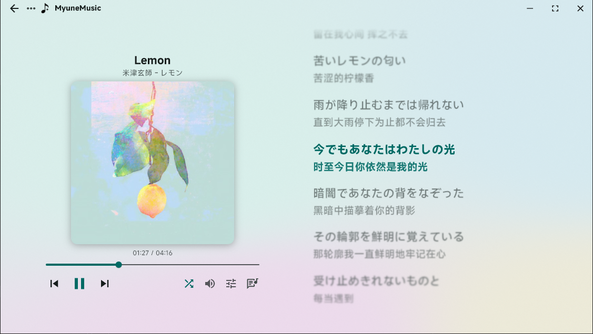

# 🎵 Myune Music

[](https://flutter.dev/)
[](#)

[](LICENSE)

一个基于 **Flutter (Dart)** 实现的简洁本地音乐播放器，支持 **Windows / Linux** 双端。

> 🍎 macOS 用户可使用社区移植版：[myune_music_macos](https://github.com/Lannamokia/myune_music_macos)

## ✨ 特性
* 💻 支持 **Windows / Linux** 双平台
* 🎶 歌曲管理：支持 **文件夹歌单** 与 **手动歌单**
* 🧠 自动按 **歌手** 与 **专辑** 分类
* 🎨 使用 [Material 3](https://m3.material.io/) 组件与配色
* 🎧 自动读取音频元数据，支持多种格式
* 📝 歌词支持：内嵌歌词、本地 `.lrc`、网络歌词源，支持本地逐字歌词
* 🔊 提供 **音调控制** 与 **倍速播放**
* ✨ 可自定义主题配色与字体
* 🖥️ 集成 **SMTC（系统媒体传输控制）** 与 **MPRIS（Linux）**
* 🧩 支持 **音频独占模式**（仅 Windows）
* 🔌 支持 **手动选择音频输出设备**
* ⚙️ **全局快捷键**支持
* 🎵 读取使用和写入 **ReplayGain** 标签


## 🔧关于 Linux

对于0.9.1及以下的版本，需要安装 `libmpv`

例如 **Ubuntu/Debian**

``` bash
sudo apt install libmpv-dev mpv 
```

对于0.9.2及以上版本，需要安装 `keybinder-3.0` 以使用全局快捷键

例如 **Ubuntu/Debian**

``` bash
sudo apt install keybinder-3.0
```

## 🎶 桌面歌词
由于 [Flutter](https://flutter.dev/) 暂不支持多窗口功能，因此暂未提供桌面歌词。
可使用以下第三方工具替代：

* [Lyricify Lite](https://apps.microsoft.com/detail/9nltpsv395k2)
* [BetterLyrics](https://apps.microsoft.com/detail/9p1wcd1p597r)

> 以上软件非本人开发，请支持原作者 🙏

## 🌐 歌词

目前仅支持UTF-8编码的 **.lrc** 文件

默认情况下，将会优先读取内嵌歌词，如果没有则读取本地 `.lrc` 文件

如果上述都无歌词的话，可以在设置中启用 **从网络获取歌词**

启用后，将在未读取到**内联歌词**和本地 `.lrc` 文件自动获取歌词

软件内默认提供了三个歌词源可供选择

实现参考 [通过歌曲名获取原文+翻译歌词](https://www.showby.top/archives/624)

### 🎵 歌词解析

假设有如下格式的歌词

>[02:55.031]照らされた世界 咲き誇る大切な人
>
>[02:55.031]在这阳光普照的世界 骄傲绽放的重要之人
>
>[02:55.031]te ra sa re ta se ka i sa ki ho ko ru ta i se tsu na hi to

可以看到这三句歌词对应的时间戳是相同的，那么软件内就会把它识别为同一句歌词的不同行

上述格式从上到下对应原文/翻译/罗马音

软件内提供设置`同时间戳歌词行数`，例如调整数值为2，最后一行（罗马音）就不会被显示

### 📃 逐字歌词

软件支持两种格式的逐字歌词：

>[00:15.237]悴[00:15.742]ん[00:15.908]だ[00:16.200]心

或者:

>[00:15.237]<00:15.237>悴<00:15.742>ん<00:15.908>だ

无需手动设置，软件会自动识别

## 📦 内嵌元数据支持

| 文件格式     | 元数据格式                     |
|-------------|------------------------------|
| AAC (ADTS)  | `ID3v2`, `ID3v1`             |
| Ape         | `APE`, `ID3v2`, `ID3v1`      |
| AIFF        | `ID3v2`, `Text Chunks`       |
| FLAC        | `Vorbis Comments`, `ID3v2`   |
| MP3         | `ID3v2`, `ID3v1`, `APE`      |
| MP4         | `iTunes-style ilst`          |
| MPC         | `APE`, `ID3v2`, `ID3v1`      |                        
| Opus        | `Vorbis Comments`            |
| Ogg Vorbis  | `Vorbis Comments`            |
| Speex       | `Vorbis Comments`            |
| WAV         | `ID3v2`, `RIFF INFO`         |
| WavPack     | `APE`, `ID3v1`               |

## 🎵 支持的音频格式

参阅 [media-kit](https://github.com/media-kit/media-kit#supported-formats)

> 部分格式需在设置启用 **允许添加任何格式的文件**


## 📸 软件截图






## 🚀 快速开始

### 环境要求

* 安装 **Rust** 环境
* 安装 **Flutter SDK**，**Dart** 版本需 ≥ 3.10.0，**Flutter** 版本需 ≥ 3.41.0

### 安装依赖

```bash
flutter pub get
```

### 启动项目

```bash
flutter run
```

### 构建项目
```bash
flutter build windows --release # 或对应平台名
```

## 🧱 使用的依赖与致谢

| 插件                                                                      | 功能             |
| ----------------------------------------------------------------------- | -------------- |
| [lofty-rs](https://github.com/serial-ata/lofty-rs) | 读取音频元信息        |
| [media_kit](https://pub.dev/packages/media_kit)                         | 音频播放支持         |
| [anni_mpris_service](https://pub.dev/packages/anni_mpris_service)       | D-Bus MPRIS 控件 |

更多依赖请查看 [pubspec.yaml](pubspec.yaml)。

特别感谢：

* [爱情终是残念](https://aqzscn.cn/archives/flutter-smtc)
* [Ferry-200](https://github.com/Ferry-200/coriander_player)

> 提供了 Rust + Flutter 的 SMTC 实现参考 🙏

## ❤️ 贡献与赞助
如果你喜欢这个项目，觉得它对你有帮助，可以通过以下方式支持我，让我有动力继续维护和更新

### 🧩 贡献
* 创建一个 [Issue](https://github.com/xiaobaimc/myune_music/issues)

可以是bug反馈，新功能请求，或者是某个地方的优化

* 创建一个 [Pull Request](https://github.com/xiaobaimc/myune_music/pulls)

可以是bug修复，添加新功能，或者是某个地方的优化

对于新功能的PR，请先创建一个 Issue 探讨该功能是否需要

### ☕ 赞助

* [爱发电](https://ifdian.net/a/xiaobaimc)

## 📄 许可证

本项目使用 **Apache License 2.0** 开源许可协议。
详细内容请查看根目录下的 [LICENSE](/LICENSE) 文件。

## 🔤 字体版权说明（Font License）

本项目使用小米公司提供的 **MiSans 字体**，该字体已明确允许**免费商用**。

* 字体版权归小米公司所有
* 相关许可协议请查阅：[MiSans 字体知识产权使用许可协议](https://hyperos.mi.com/font-download/MiSans%E5%AD%97%E4%BD%93%E7%9F%A5%E8%AF%86%E4%BA%A7%E6%9D%83%E8%AE%B8%E5%8F%AF%E5%8D%8F%E8%AE%AE.pdf)
* MiSans 官网：[https://hyperos.mi.com/font/](https://hyperos.mi.com/font/)

## Star History Chart

[](https://star-history.com/#xiaobaimc/myune_music&Date)
