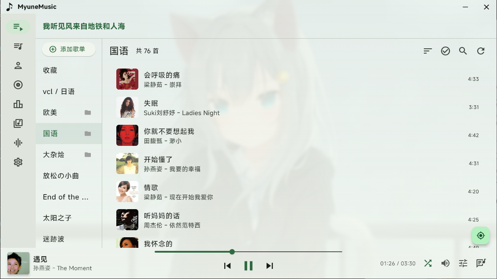
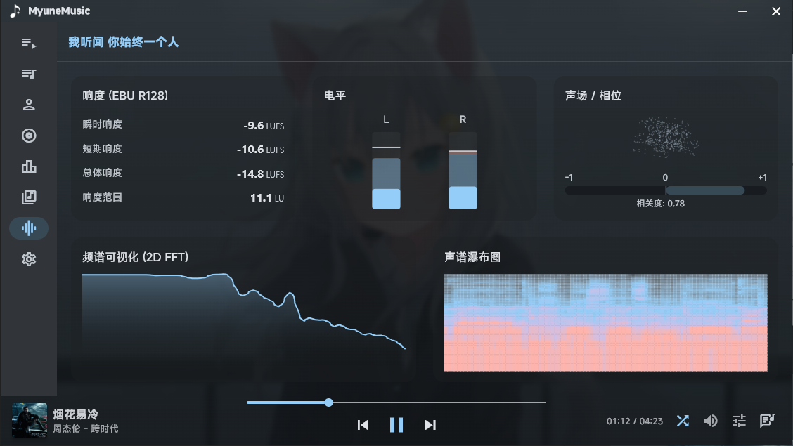

# 🎵 Myune Music

<div align="center">

### 基于 Flutter 构建的跨平台本地音乐播放器

<!-- 技术与协议胶囊徽章 -->
<p align="center">
  <a href="https://flutter.dev/"></a>
  
  
  <a href="LICENSE"></a>
</p>

<!-- Trendshift 趋势荣誉卡片 -->
<p align="center">
  <a href="https://trendshift.io/repositories/18744?utm_source=trendshift-badge&amp;utm_medium=badge&amp;utm_campaign=badge-trendshift-18744" target="_blank" rel="noopener noreferrer"></a>
  &nbsp;&nbsp;
  <a href="https://trendshift.io/repositories/18744?utm_source=repository-badge&amp;utm_medium=badge&amp;utm_campaign=badge-repository-18744" target="_blank" rel="noopener noreferrer"></a>
</p>

</div>

---

## ✨ 特性
* 💻 支持 **Windows / Linux** 双平台
* 🎶 歌曲管理：支持 **文件夹歌单** 与 **手动歌单**
* 🧠 自动按 **歌手** 与 **专辑** 分类
* 🎨 使用 [Material 3](https://m3.material.io/) 组件与配色
* 📝 多种歌词支持：内嵌歌词、本地 `lrc、yrc、qrc、krc 文件`、网络歌词源，支持逐字歌词
* 🔊 提供多种音频滤镜与EQ支持
* ✨ 可自定义主题配色、字体、背景图
* 🧩 支持 **音频独占模式**（仅 Windows）
* ⚙️ **全局快捷键**支持
* 🎵 读取使用和写入 **ReplayGain** 标签
* 🔍 支持模糊搜索拼音搜索与首拼搜索
* 🎤 支持实时音频分析 (该页面默认被隐藏，可在 设置 → 个性化 → 页面可见性设置 手动开启)

## 🔧关于 Linux

对于0.9.1及以下的版本，需要安装 `libmpv`

例如 **Ubuntu/Debian**

``` bash
sudo apt install libmpv-dev mpv 
```

对于0.9.2及以上版本，需要安装 `keybinder-3.0` 以使用全局快捷键

例如 **Ubuntu/Debian**

``` bash
sudo apt install keybinder-3.0
```

如果遇到快捷方式（.desktop）不显示图标的问题 请参考 [issues #114](https://github.com/xiaobaimc/myune_music/issues/114)

## 📸 软件截图


<div align="center">

### 主界面


</div>

<div align="center">

### 播放页面


</div>

<div align="center">

### 音频分析




</div>

> 该页面默认被隐藏，可在 设置 → 个性化 → 页面可见性设置 手动开启
---

## 🎶 桌面歌词
由于 [Flutter](https://flutter.dev/) 暂不支持多窗口功能，因此暂未提供桌面歌词
可使用以下第三方工具替代：

* [Lyricify Lite](https://apps.microsoft.com/detail/9nltpsv395k2)
* [BetterLyrics](https://apps.microsoft.com/detail/9p1wcd1p597r)

> 以上软件非本人开发，请支持原作者 🙏

## 🌐 歌词

### 歌词来源与优先级

软件会按照 **歌词来源优先级** 中的顺序依次尝试获取，默认顺序：

```
内嵌歌词 → 外置 LRC → 外置 KRC → 外置 QRC → 外置 YRC → 网络歌词
```

可在「设置 → 个性化 → 歌词来源优先级」中调整顺序

> 外置歌词文件需与歌曲**同名且位于同一目录**，目前仅支持 **UTF-8** 编码

### 网络歌词

在「设置 → 常规」中启用 **从网络获取歌词** 后，若上述来源均未取到歌词，则自动从网络获取

软件默认提供三个源可供选择，三个源全部支持逐字 + 翻译+ 注音的获取

> 软件默认不会显示注音，如有需要请将```同时间戳歌词行数```设为3或以上

当前选中的源未匹配到歌曲时，会自动使用其他源进行匹配

> 特别感谢 [lyricGeter](https://github.com/WisteriaZy/lyricGeter/) 提供的歌词获取以及处理逻辑

### 歌词解析

假设有如下格式的歌词：

>[02:55.031]照らされた世界 咲き誇る大切な人
>
>[02:55.031]在这阳光普照的世界 骄傲绽放的重要之人
>
>[02:55.031]te ra sa re ta se ka i sa ki ho ko ru ta i se tsu na hi to

三句歌词时间戳相同，软件会识别为同一句歌词的不同行，从上到下依次对应 **原文 / 翻译 / 罗马音**

此时可通过「歌词显示设置 → 同时间戳歌词行数」控制显示行数：例如设为 `2`，最后一行（罗马音）将不再显示

### 逐字歌词

支持两种格式，软件会自动识别，无需手动设置：

>[00:15.237]悴[00:15.742]ん[00:15.908]だ[00:16.200]心

或：

>[00:15.237]<00:15.237>悴<00:15.742>ん<00:15.908>だ

---

## 📦 内嵌元数据支持

| 文件格式     | 元数据格式                     |
|-------------|------------------------------|
| AAC (ADTS)  | `ID3v2`, `ID3v1`             |
| Ape         | `APE`, `ID3v2`, `ID3v1`      |
| AIFF        | `ID3v2`, `Text Chunks`       |
| FLAC        | `Vorbis Comments`, `ID3v2`   |
| MP3         | `ID3v2`, `ID3v1`, `APE`      |
| MP4         | `iTunes-style ilst`          |
| MPC         | `APE`, `ID3v2`, `ID3v1`      |                        
| Opus        | `Vorbis Comments`            |
| Ogg Vorbis  | `Vorbis Comments`            |
| Speex       | `Vorbis Comments`            |
| WAV         | `ID3v2`, `RIFF INFO`         |
| WavPack     | `APE`, `ID3v1`               |

## 🎵 支持的音频格式

底层使用 mpv，依赖 FFmpeg 解码，理论上支持绝大多数音频格式

部分格式需在「设置 → 高级」中启用 **允许添加任何格式的文件** 后方可添加到歌单

> 可参阅 [media-kit 支持格式列表](https://github.com/media-kit/media-kit#supported-formats) 作为参考

---

## 🚀 从源码构建


### 环境要求

* 安装 **Rust** 环境
* 安装 **Flutter SDK**，**Dart** 版本需 ≥ 3.10.0，**Flutter** 版本需 ≥ 3.47.0

### 安装依赖

```bash
flutter pub get
```

### 启动项目

```bash
flutter run
```

### 构建项目
```bash
flutter build windows --release # 或对应平台名
```

## ❤️ 贡献与赞助

### 🧩 贡献
* 创建一个 [Issue](https://github.com/xiaobaimc/myune_music/issues)：bug 反馈、新功能请求或优化建议
* 创建一个 [Pull Request](https://github.com/xiaobaimc/myune_music/pulls)：bug 修复、新功能或优化

> 对于新功能的 PR，请先创建一个 Issue 探讨该功能是否需要

提交前建议执行 `flutter analyze` 检查静态分析结果

### ☕ 赞助

* [爱发电](https://ifdian.net/a/xiaobaimc)

---

## 🧱 使用的依赖

| 插件 | 功能 |
| --- | --- |
| [mpv_audio_kit](https://github.com/ales-drnz/mpv_audio_kit) | 音频播放支持 |
| [lofty-rs](https://github.com/serial-ata/lofty-rs) | 读取与写入音频元信息 |
| [anni_mpris_service](https://pub.dev/packages/anni_mpris_service) | D-Bus MPRIS 控件 |
| [silky_scroll](https://pub.dev/packages/silky_scroll) | 平滑滚动效果 |
| [window_manager](https://pub.dev/packages/window_manager) / [tray_manager](https://pub.dev/packages/tray_manager) | 窗口与系统托盘控制 |

更多依赖请查看 [pubspec.yaml](pubspec.yaml)


## 📄 许可证

本项目使用 **Apache License 2.0** 开源许可协议
详细内容请查看根目录下的 [LICENSE](LICENSE) 文件

### 🔤 字体版权说明（Font License）

本项目使用小米公司提供的 **MiSans 字体**，该字体已明确允许**免费商用**

* 字体版权归小米公司所有
* 相关许可协议请查阅：[MiSans 字体知识产权使用许可协议](https://hyperos.mi.com/font-download/MiSans%E5%AD%97%E4%BD%93%E7%9F%A5%E8%AF%86%E4%BA%A7%E6%9D%83%E8%AE%B8%E5%8F%AF%E5%8D%8F%E8%AE%AE.pdf)
* MiSans 官网：[https://hyperos.mi.com/font/](https://hyperos.mi.com/font/)

---

## Star History Chart

[](https://star-history.com/#xiaobaimc/myune_music&Date)
